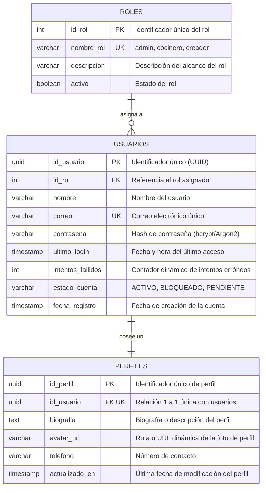

# Modelo Relacional: Autenticación, Roles y Perfil 🗄️

Este documento describe el diseño del **Modelo Relacional** enfocado exclusivamente en las tres entidades fundamentales del módulo: **Roles**, **Usuarios** y **Perfil de Usuario**.

---

## 📊 Diagrama Entidad-Relación (Mermaid)

